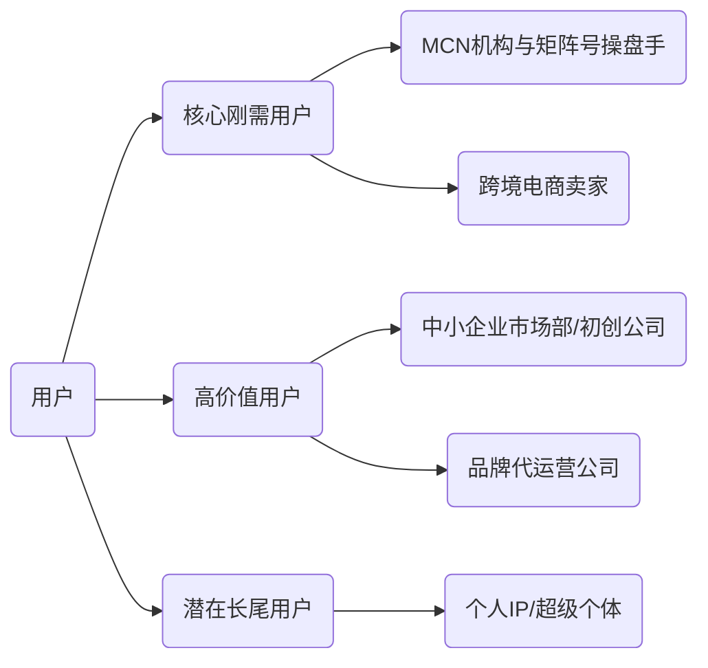
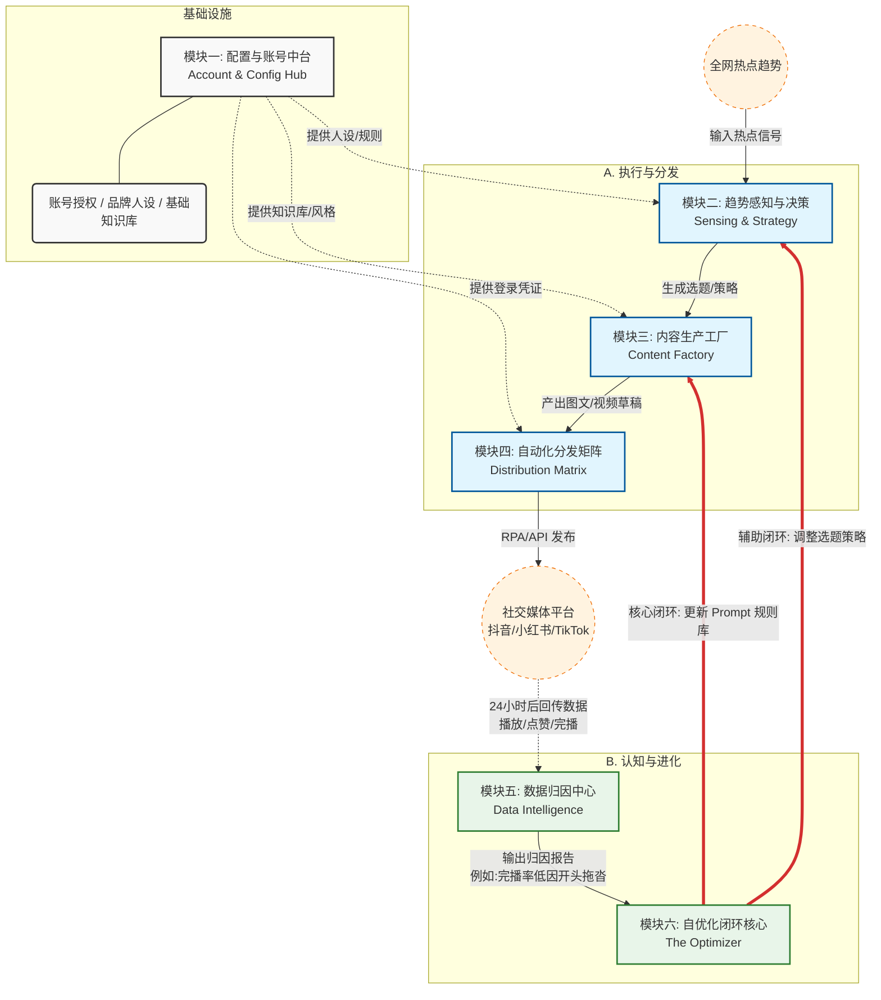
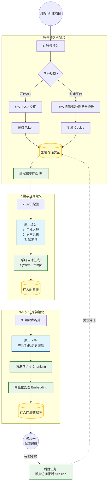
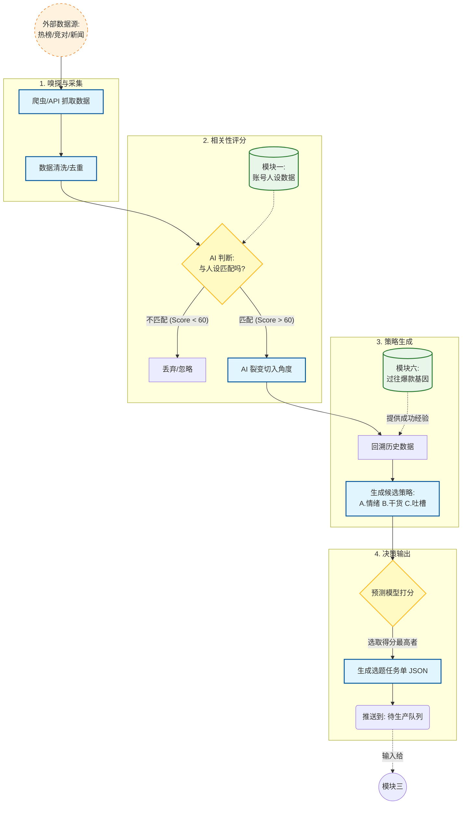
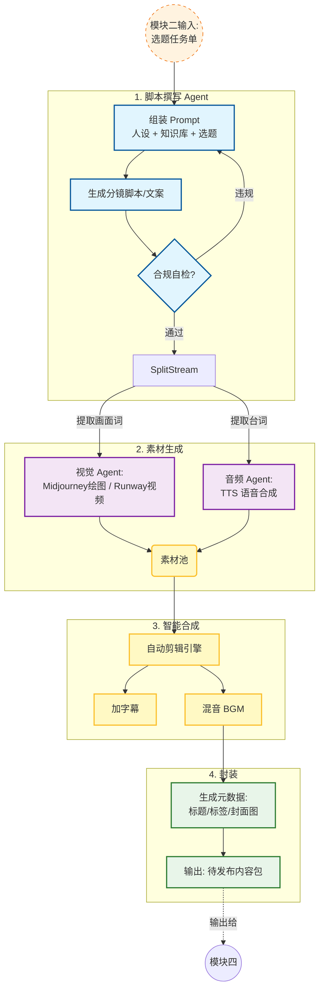
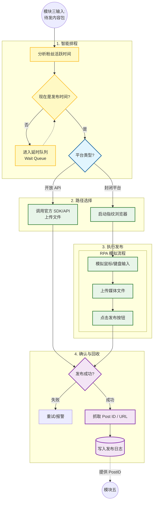
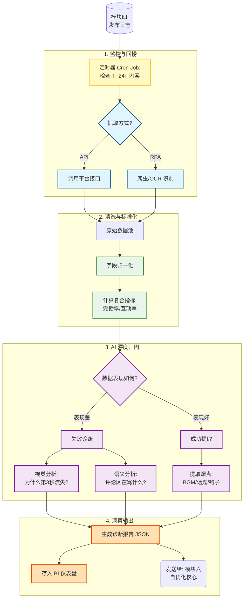
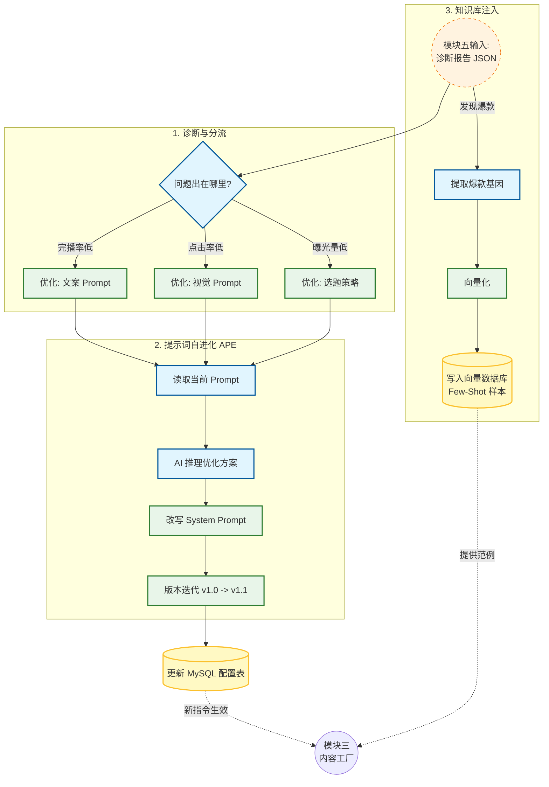

# 需求文档

项目：多平台社媒从发布到数据分析，AI自由化闭环

通俗理解：雇佣了一个不知疲倦、且能通过“吃一堑长一智”自我进化的”超级数字员工“

第一步：做与发（Action）

- 它做什么：系统根据当下的热点或你的要求，利用AI自动写文案、作图、剪视频、然后利用RPA（自动化程序）一键发布到抖音、小红书、知乎等多个平台
- 比如：它自动生成了10条关于“AI办公”的视频发到了抖音

第二步：看与诊（Observation）

- 它做什么：视频发出去24小时后，系统自动去后台抓取数据（播放量、完播率、点赞、评论关键词）
- 比如：它发现其中第3条视频爆了，完播率很高；第7条视频没人看，用户在第3秒就划走了

第三步：学与改（Optimization）---核心差异点

- 它做什么：这是关键的一步，AI会分析数据背后的原因，并修改自己的大脑指令（Prompt）
  - 分析：第7条视频为什么没有人看？AI分析数据后发现，前3秒语速太慢，且背景音乐太悲伤
  - 自优化：系统自动更新“视频生成脚本”的规则---“以后生成的视频，前3秒语速提升1.5倍，且必须使用快节奏BGM”
- 结果：第二天生成的视频，自动避开了之前的坑，质量更高了


## 面向哪些用户

它的目标用户不是偶尔发发朋友圈的普通人，而是***“靠流量吃饭”、对数据敏感、且渴望降低人力成本的的群体***



| **用户类型**   | **核心诉求**     | **对“自优化闭环”的期待**                       | **付费意愿**           |
| -------------- | ---------------- | ---------------------------------------------- | ---------------------- |
| **MCN/矩阵号** | **降本、规模化** | 像“养蛊”一样，自动筛选出流量最好的账号和模板。 | ⭐⭐⭐⭐⭐ (按账号数付费)   |
| **跨境电商**   | **引流、转化**   | 快速试错，自动找到转化率最高的视频素材。       | ⭐⭐⭐⭐⭐ (按GMV/转化付费) |
| **中小企业**   | **省钱、冷启动** | 代替“初级运营员工”，保证账号活着且在更新。     | ⭐⭐⭐⭐ (SaaS订阅费)      |
| **代运营公司** | **提效、扩利**   | 减少重复劳动，生成漂亮的客户报表。             | ⭐⭐⭐⭐ (企业版定制)      |
| **个人博主**   | **辅助、灵感**   | 帮我分析数据，告诉我粉丝喜欢什么，别让我瞎猜。 | ⭐⭐⭐ (个人版订阅)       |


## 主要模块

### 模块一：配置与账号中台

定位：系统的“基础设施”，负责连接世界和定义身份

主要功能：

- 多平台账号授权管理
  - 支持OAuth2.0授权（针对YouTube、TikTok、X等开放API平台）
  - 支持Cookie/Session保持与保活（针对小红书、抖音等需要RPA介入的平台）
  - 账号分组管理（如：矩阵A、矩阵B）
- 人设与知识库配置（RAG）
  - Persona设定：定义每个账号的语气、风格（如：严谨专家风、搞怪吐槽风）
  - 知识库上传：用户上传产品手册、白皮书、过往爆款文章，作为AI生成内容的“事实依据”
- 安全风控中心
  - IP隔离与代理池管理（防止多号同IP被封）
  - 操作频率限制（模拟人类行为，避免触发平台反爬机制）


### 模块二：趋势感知与决策引擎

定位：系统的“大脑”，解决“发什么”的问题

主要功能：

- 全网热点监控
  - 实时抓取各大平台热搜榜（微博、抖音热搜、Google Trends）
  - 竞对数据监控：追踪指定竞争对手账号，分析其最新爆款
- 选题智能推荐
  - 热点匹配：AI分析“热点”与“账号人设”的交集，判断是否可蹭热度
  - 选题生成：每日生成N个选题候选项（含标题、核心卖点），供用户确认或系统自动选择


### 模块三：多模态内容生产工厂

定位：系统的“手”，解决“怎么做”的问题

主要功能：

- 智能脚本/文案生成
  - 根据选定的平台，自动调整文案结构（小红书=标题党+Emoji+种草；知乎=逻辑推演+长文）
  - SEO优化：自动嵌入高搜索量的长尾关键词
- 视觉素材生成（AIGC）
  - 图片生成：调用Midjourney/Flux生成封面图、插图
  - 视频生成/混剪：
    - 数字人生成（HeyGen/D-ID接口）
    - 素材库混剪：根据脚本关键词，自动抓取库存素材或网络无版权素材进行拼接（类似“剪映”自动化）
- 内容合规预审
  - 自动检测违禁词、敏感话题，确保内容安全


### 模块四：自动化分发矩阵

定位：系统的“腿”，解决“怎么发”的问题

主要功能：

- 全平台一键发布
  - 自动填写标题、描述、话题标签、封面选择、地理位置
  - 支持API推送与RPA模拟上传两组模式
- 智能排程
  - 根据历史数据，自动计算每个账号粉丝最活跃的时间段
  - 支持定时发布、队列发布（避免短时间高并发发布）
- 互动管理
  - 聚合所有平台的评论与私信
  - AI自动回复（根据预设话术库或者大模型生成回复），提升账号活跃度


### 模块五：数据归因与分析中心

定位：系统的“眼睛”，解决“效果如何”的问题

主要功能：

- 跨平台数据聚合
  - 将不同平台（播放、阅读、点赞、收藏、转发、完播率）的数据标准化
  - 提供可视化报告：趋势图、漏斗图
- 深度归因分析
  - 爆款分析：为什么这条火了？（归因于：标题关键词？BGM?发布时间？）
  - 流失分析：为什么这条完播率低？（通过视频帧分析，定位用户划走的具体秒数）


### 模块六：自优化闭环核心

定位：系统的“灵魂”，解决“怎么变强”的问题。这是本项目与传统工具的根本区别

主要功能：

- 策略自动迭代
  - 负反馈机制：如果某类风格连续3次数据低于平均值，系统自动修改Prompt中的“风格参数”
  - 正反馈机制：如果某条内容成为爆款，系统将其加入“Few-Shot样本库”，让后续生成模仿该结构
- A/B测试实验室
  - 自动执行灰度测试：例如，同一内容的3个不同封面，分别分发到权重相似的账号，测试点击率
  - 胜出者逻辑：自动将测试中胜出的策略应用到所有主账号


## 模块间如何配合




**M1 (中台) -> M2/M3/M4 (执行)：**

- M1 是地基。没有它提供的账号 Token 和“人设定义”，后面的模块不知道我是谁，也不知道发什么风格。

**M2 -> M3 -> M4 (顺时针生产)：**

- 这是传统的线性工作流。趋势(M2)变成了内容(M3)，最后被发射出去(M4)。

**ExtPlatforms -> M5 (逆时针反馈)：**

- 这是**感知**的开始。系统必须等待现实世界的真实反馈（数据）。

**M6 -> M3 (红色粗箭头 - 核心闭环)：**

- **这是整个系统的灵魂。**
- M6 (优化器) 就像一个严厉的教练。它看到数据不好，不会去修补已经发出去的内容，而是**直接修改 M3 (工厂) 的操作手册 (Prompt)**。
- *例子：* M6 告诉 M3：“上次那个视频前3秒太慢了，下次生成视频时，强制剪辑节奏加快 20%。”

**M6 -> M2 (策略调整)：**

- 如果连续多条内容数据都差，M6 会告诉 M2：“这个话题（如‘元宇宙’）已经过气了，把这个话题权重调低，换个新赛道。”


## 模块一：配置与账号中台

分为四部分：

1. 账号接入与鉴权
2. 矩阵分组与环境隔离
3. 数字化人设配置
4. 专属知识库构建





## 模块二：趋势感知与决策引擎

分为四部分：

1. 全网嗅探与数据采集
2. 语义清洗与相关性评分
3. 策略生成与角度切入
4. 最终决策与排期



当模块二结束时，它不会产出视频或文章，而是产出“生产指令单”，作为模块三的输入，其格式如下：

```json
{
  "task_id": "T20251129-001",
  "topic_source": "抖音热榜TOP3 - DeepSeek发布",
  "target_account": "科技博主_01",
  "chosen_strategy": {
    "angle_type": "对比测评",
    "core_message": "国产模型 DeepSeek 到底能不能打过 GPT-4？",
    "tone": "客观、数据流、语速快",
    "required_elements": [
      "必须包含代码生成速度对比画面",
      "结尾引导用户去评论区领测试地址"
    ]
  },
  "priority": "High"
}
```


## 模块三：多模态内容生产工厂

分为四部分：

1. 结构化脚本撰写
2. 多模态素材生成
3. 智能合成与剪辑
4. 封装与元数据生成



模块三的产出是一个标准的“待发布内容包”，通常是一个文件夹或一个json对象，包含所有上传需要的文件路径，其格式如下：

```json
{
  "task_id": "T20251129-001",
  "status": "Ready_to_Publish",
  "content_type": "Video",
  "assets": {
    "video_file": "s3://bucket/output/deepseek_review_v1.mp4",
    "cover_image": "s3://bucket/output/cover_thumb.jpg",
    "srt_file": "s3://bucket/output/subs.srt"
  },
  "metadata": {
    "title": "国产之光？DeepSeek 深度测评，结果吓我一跳！",
    "description": "实测国产大模型 DeepSeek，代码生成能力直逼 GPT-4... #AI #DeepSeek #国产大模型",
    "tags": ["AI", "科技", "编程"]
  }
}
```


## 模块四：自动化分发矩阵

分为四部分：

1. 智能排程与队列管理
2. 分发路径路由
3. 执行发布动作
4. 发布确认与ID回收



模块四运行结束后，会生成一条“发布日志”，这是模块五（数据分析）工作的起点，其格式如下所示：

```json
{
  "publish_id": "PUB_20251129_099",
  "task_id": "T20251129-001",
  "platform": "Xiaohongshu",
  "account_id": "Acc_Beauty_01",
  "status": "Success",
  "publish_time": "2025-11-29 20:05:12",
  "post_result": {
    "platform_post_id": "6564c7e...",  // 小红书笔记ID，用于后续抓数据
    "post_url": "https://www.xiaohongshu.com/explore/6564c7e...",
    "screenshot_path": "s3://logs/pub_success_099.jpg"
  }
}
```


## 模块五：数据归因与分析中心

分为四部分：

1. 监控触发与数据回捞
2. 数据清洗与标准化
3. AI深度归因分析
4. 洞察报告生成




模块五最终产出一条“内容诊断报告”，其格式如下：

```json
{
  "content_id": "Video_DeepSeek_001",
  "performance_score": 45,  // 满分100，不及格
  "metrics": {
    "views": 5200,
    "ctr": "8.5%",       // 点击率不错
    "retention_3s": "15%" // 完播率极低，灾难级
  },
  "diagnosis": {
    "status": "High_Click_Low_Retention", // 典型的“标题党”
    "issues": [
      {
        "type": "retention_drop",
        "timestamp": "00:03",
        "reason": "Audio_Silence",
        "description": "检测到第3秒有长达2秒的静音，导致用户流失"
      },
      {
        "type": "sentiment_negative",
        "keywords": ["听不清", "声音小", "字幕呢"]
      }
    ]
  },
  "actionable_insight": "Audio_Volume_Boost_Required" // 给模块六的直接指令
}
```


## 模块六：自优化闭环核心

分为四部分：

1. 诊断分流与决策
2. 动态提示词工程
3. 优胜劣汰与知识库注入
4. A/B测试实验配置




## 整体


